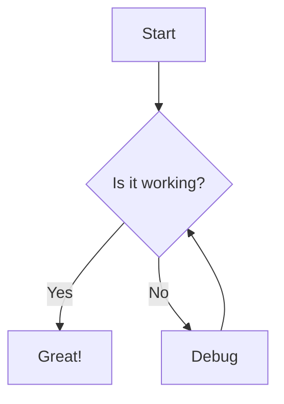
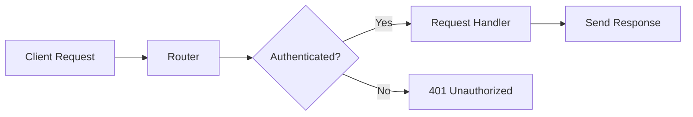
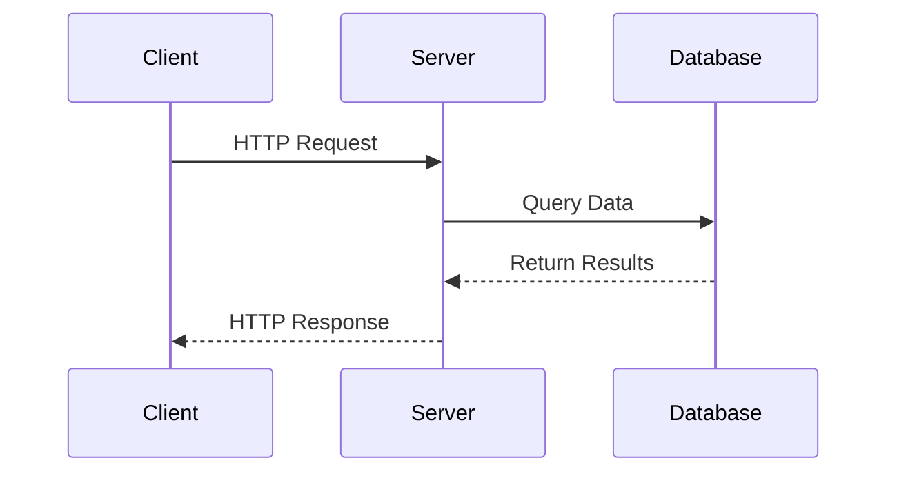
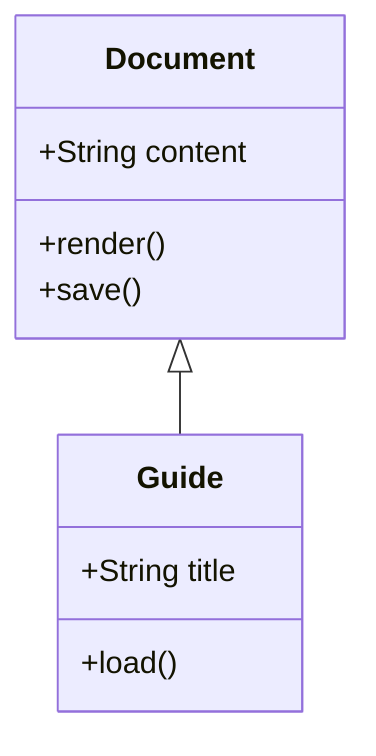
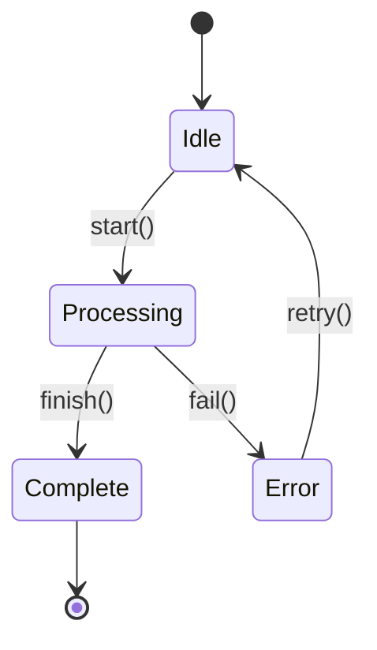

# Mermaid Diagrams

This guide explains how to use Mermaid diagrams in your documentation to visualize complex relationships, flows, and architectures.

## Overview

Mermaid diagrams help visualize concepts that are difficult to explain with text alone. Use diagrams to complement your documentation when you need to show:

- System architecture and component relationships.
- Data flow between components.
- State machines and lifecycle transitions.
- Sequence diagrams for interactions.
- Class hierarchies and dependencies.

## When to Use Diagrams

Use Mermaid diagrams when:
- **Architecture Overview**: Show how major components connect and interact.
- **Flow Visualization**: Illustrate decision trees, request flows, or data pipelines.
- **State Transitions**: Document lifecycle changes or state machines.
- **Sequence Interactions**: Show the order of operations between multiple components.

Don't use diagrams when:
- A simple bulleted list would be clearer.
- The diagram would be overly complex (>15 nodes).
- Text descriptions are sufficient.

## Syntax

Mermaid diagrams are embedded in markdown using code blocks with the `mermaid` language identifier:

~~~markdown

~~~

## Common Diagram Types

### Flowcharts

Use flowcharts to show decision logic, process flows, or branching paths:

### Sequence Diagrams

Show interactions between components over time:

### Class Diagrams

Document object-oriented relationships:

### State Diagrams

Illustrate state transitions and lifecycle:

## Best Practices

1. **Keep it Simple**: Limit diagrams to 10-15 nodes for readability.
2. **Use Clear Labels**: Node labels should be concise but descriptive.
3. **Consistent Styling**: Use similar diagram types for similar concepts.
4. **Context First**: Explain what the diagram shows before presenting it.
5. **Complement, Don't Replace**: Use diagrams alongside text explanations.
6. **Test Rendering**: Verify diagrams render correctly in the documentation.

## Reference

For complete Mermaid syntax and diagram types, see the [Mermaid documentation](https://mermaid.js.org/).
